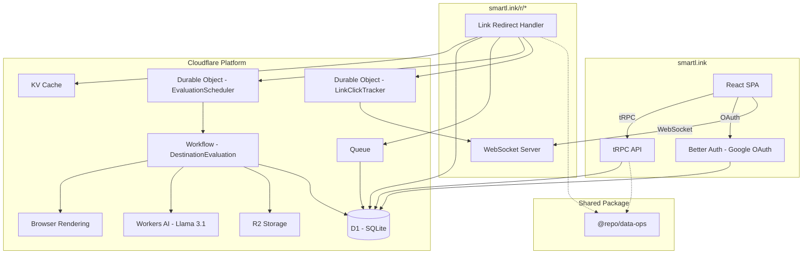
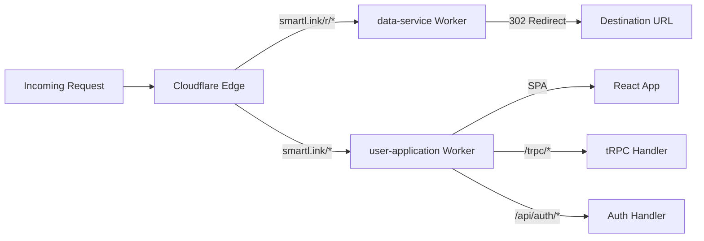
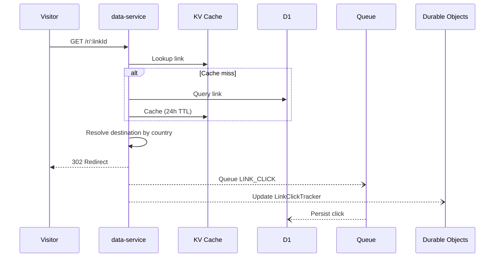
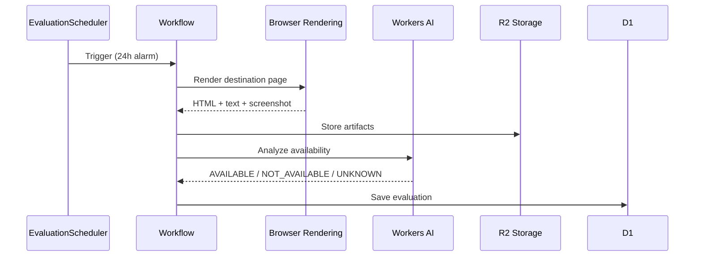

# Smart Links

A geo-aware link management platform running entirely on Cloudflare's edge. Create short links that route visitors to different destinations based on their country, track clicks in real-time via WebSockets, and use AI to evaluate whether destination pages are still available.

**Production:** `smartl.ink`
**Staging:** `stage.smartl.ink`

## Architecture

### System Overview



### Domain Routing



The data-service Worker intercepts `smartl.ink/r/*` via a zone route. Everything else falls through to the user-application Worker, which is bound as a custom domain. The user-application serves the React SPA for non-API paths and runs the Worker first for `/trpc/*`, `/api/auth/*`, and `/click-socket`.

### Link Redirect Flow



### Destination Evaluation Flow



## Tech Stack

| Layer | Technology |
|-------|-----------|
| Runtime | Cloudflare Workers |
| Frontend | React 19, TanStack Router, TanStack Query, Tailwind CSS |
| API | tRPC 11, Hono |
| Database | Cloudflare D1 (SQLite), Drizzle ORM |
| Auth | Better Auth (Google OAuth) |
| Real-time | WebSocket via Durable Objects |
| AI | Workers AI (Llama 3.1 8B) |
| Async | Cloudflare Queues, Workflows |
| Cache | Cloudflare KV |
| Storage | Cloudflare R2 |
| Validation | Zod |
| State | Zustand |
| Monorepo | pnpm workspaces |

## Project Structure

```
links-cloudflare/
├── apps/
│   ├── data-service/            # Link redirects, click tracking, evaluations
│   │   ├── src/
│   │   │   ├── hono/            # HTTP routes (/:id redirect, /click-socket)
│   │   │   ├── durable-objects/ # EvaluationScheduler, LinkClickTracker
│   │   │   ├── workflows/       # Destination evaluation pipeline
│   │   │   ├── queue-handlers/  # Click persistence from queue
│   │   │   └── helpers/         # KV caching, AI checker, browser render
│   │   └── wrangler.jsonc
│   │
│   └── user-application/        # React SPA + tRPC API
│       ├── src/
│       │   ├── routes/          # TanStack file-based routes
│       │   ├── components/      # Shadcn UI + custom components
│       │   └── hooks/           # WebSocket, Zustand stores
│       ├── worker/
│       │   ├── hono/            # Auth middleware, route dispatch
│       │   └── trpc/            # tRPC routers (links, evaluations)
│       └── wrangler.jsonc
│
├── packages/
│   └── data-ops/                # Shared data layer
│       ├── src/
│       │   ├── db/              # Drizzle database setup
│       │   ├── drizzle-out/     # Generated schema + migrations
│       │   ├── queries/         # Link and evaluation queries
│       │   ├── zod/             # Validation schemas
│       │   └── auth.ts          # Better Auth config
│       └── drizzle.config.ts
│
├── package.json                 # Workspace scripts
└── pnpm-workspace.yaml
```

## Getting Started

### Prerequisites

- Node.js v18+
- pnpm
- Wrangler CLI (`npm install -g wrangler`)
- Cloudflare account with D1, KV, R2, Queues enabled

### Development

```bash
pnpm install

# Build shared package (required before running apps)
pnpm build-package

# Terminal 1: frontend on port 3000
pnpm dev-frontend

# Terminal 2: data service
pnpm dev-data-service
```

### Database

```bash
cd packages/data-ops

pnpm pull       # Pull schema from remote D1
pnpm generate   # Generate migration files
pnpm migrate    # Apply migrations
pnpm studio     # Open Drizzle Studio GUI
```

### Deployment

Both apps deploy as Cloudflare Workers. The shared package is built first automatically.

```bash
# Staging (stage.smartl.ink)
pnpm stage:deploy-frontend
pnpm stage:deploy-data-service

# Production (smartl.ink)
pnpm production:deploy-frontend
pnpm production:deploy-data-service
```

## Environments

| Resource | Staging | Production |
|----------|---------|------------|
| Frontend domain | `stage.smartl.ink` | `smartl.ink` |
| Redirect path | `stage.smartl.ink/r/*` | `smartl.ink/r/*` |
| D1 database | `f290b3e1-...` | `92b7bd53-...` |
| KV namespace | `acfb83ec...` | `c82c11ee...` |
| Queue | `smart-links-data-queue-stage` | `smart-links-data-queue-production` |
| R2 bucket | `smart-links-eval-stage` | `smart-links-eval-production` |
| Service binding | `data-service-stage` | `data-service-production` |

## Database Schema

**`links`** - Short link definitions with geo-routing destinations
- `linkId`, `accountId`, `name`, `destinations` (JSON: `{ default: url, [country]: url }`)

**`link_clicks`** - Click event log
- `id`, `accountId`, `country`, `destination`, `clickedTime`, `latitude`, `longitude`

**`destination_evaluations`** - AI availability assessments
- `id`, `linkId`, `accountId`, `destinationUrl`, `status`, `reason`, `createdAt`
- Status values: `AVAILABLE_PRODUCT`, `NOT_AVAILABLE_PRODUCT`, `UNKNOWN_STATUS`

Auth tables (`user`, `session`, `account`, `verification`) are managed by Better Auth.

## Key Features

**Geo-routing** - Each link stores a default destination plus per-country overrides. The data-service reads the visitor's country from Cloudflare headers (`cf-ipcountry`) and redirects accordingly.

**Real-time click tracking** - Clicks are queued for persistent storage and simultaneously pushed to a LinkClickTracker Durable Object, which broadcasts to connected WebSocket clients on the dashboard.

**AI destination evaluation** - A scheduled workflow renders each destination with headless Chrome, feeds the page content to Llama 3.1, and classifies product availability. Results surface as problematic links in the dashboard.

**Edge caching** - Link routing data is cached in KV with a 24-hour TTL to minimize D1 reads on the hot redirect path.

## License

See [LICENSE](./LICENSE).
